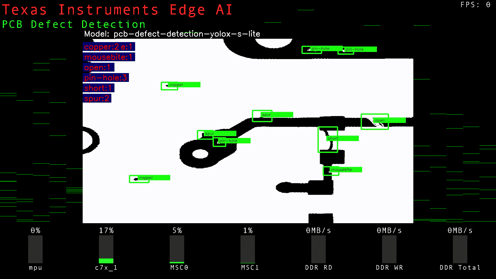
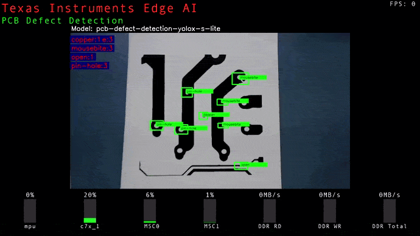
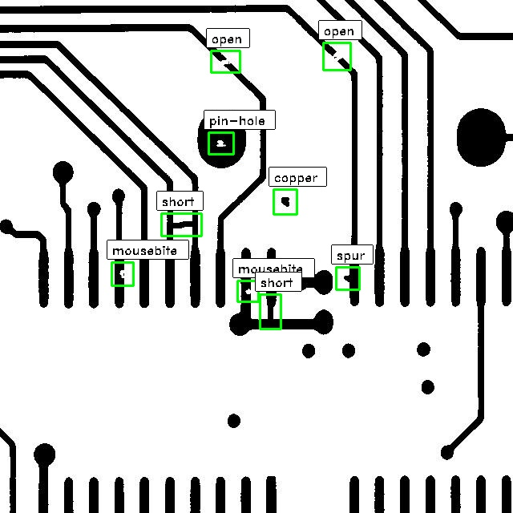

# Edge AI GStreamer Apps for PCB Defect Detection
> Repository to host GStreamer based Edge AI applications for TI devices

This repo adds support for pcb defect detection on top of edgeai-gst-apps

## Table of content
- [Supported Devices](#supported-devices)
- [SDK Version](#sdk-version)
- [Steps to run](#steps-to-run)
- [Result](#result)
- [But what is the usecase?](#but-what-is-the-usecase)
- [How to train your own model?](#how-to-train-your-own-model)
- [How to run the model on target device?](#how-to-run-the-model-on-target-device)
- [How to add custom post-processing?](#how-to-add-custom-post-processing)

## Supported Devices

| **DEVICE**              | **Supported**      |
| :---:                   | :---:              |
| AM62A                   | :heavy_check_mark: |

## SDK Version

This demo is supported on **EdgeAI SDK Version 9.0**

## Steps to run:

1. Clone this repo in your target under /opt

    ```console
    root@soc:/opt# git clone https://github.com/TexasInstruments/edgeai-gst-apps-pcb-defect-detection.git
    root@soc:/opt# cd edgeai-gst-apps-pcb-defect-detection
    ```

2. Download and untar model for pcb defect detection

    ```console
    root@soc:/opt/edgeai-gst-apps-pcb-defect-detection# wget --proxy off https://software-dl.ti.com/jacinto7/esd/edgeai-marketplace/pcb-defect-detection/09_00_00/pcb-defect-detection-yolox-s-lite.tar.gz
    root@soc:/opt/edgeai-gst-apps-pcb-defect-detection# tar -xf pcb-defect-detection-yolox-s-lite.tar.gz -C /opt/model_zoo/
    ```

3. Download sample input images

    ```console
    root@soc:/opt/edgeai-gst-apps-pcb-defect-detection#  wget --proxy off https://software-dl.ti.com/jacinto7/esd/edgeai-marketplace/pcb-defect-detection/09_00_00/pcb-defect-detection-sample-images.tar.gz
    root@soc:/opt/edgeai-gst-apps-pcb-defect-detection# tar -xf pcb-defect-detection-sample-images.tar.gz -C /opt/edgeai-test-data/
    ```

4. Run the python app

    ```console
    root@soc:/opt/edgeai-gst-apps-pcb-defect-detection# cd apps_python
    root@soc:/opt/edgeai-gst-apps-pcb-defect-detection/apps_python# ./app_edgeai.py ../configs/pcb_defect_detection.yaml
    ```

5. Compile cpp apps

    ```console
    root@soc:/opt/edgeai-gst-apps-pcb-defect-detection# ./scripts/compile_cpp_apps.sh
    ```

6. Run CPP app

    ```console
    root@soc:/opt/edgeai-gst-apps-pcb-defect-detection# cd apps_cpp
    root@soc:/opt/edgeai-gst-apps-pcb-defect-detection/apps_cpp# ./bin/Release/app_edgeai ../configs/pcb_defect_detection.yaml
    ```
## Result
<br/>
<p align="center">

</p>
<p align="center">

</p>

## But what is the usecase?

Printed circuit boards are the backbone of electronic industry. Billions of PCBs are designed and printed every year.
It is absolutely certain that there might be some defects introduced during the design and/or printing of the boards.
Given the vast complexity of the circuits it becomes challenging to detect these defects efficiently. This problem
can be solved with the blessing that is AI. A model can be trained to recognize such defects because AI models are
great at detecting anomalies in a pattern. A image of linear CCD scan can be the input to the model which can
predict defects that it might have. Some common type of PCB defects as described in [DeepPCB](https://paperswithcode.com/dataset/deep-pcb)
dataset are open,short,mousebite,spur,pin hole and spurious copper.
Such models can be deployed to run on vision processing devices like [AM62A](https://www.ti.com/tool/SK-AM62A-LP) to detect defects during design or manufacture process.

<br/>
<p align="center">

</p>


## How to train your own model?

### Collecting and processing the data

Data collection is the foremost part of training an AI model. Just like us humans, AI also
needs good quality data to learn from. The data used for this case is 1500 linear CCD
scanned images of various PCB with defects marked with bounding boxes. Here is the link to
[DeepPCB dataset](https://github.com/tangsanli5201/DeepPCB/tree/master/PCBData).

This dataset is not in COCO JSON format. We need to convert this dataset to COCO JSON to make
it compatible with out modelmaker. A script provided under **assets/convert_to_coco.py** can be
used to convert the following to annotated dataset compatible with modelmaker. Follow the steps below
on your PC convert the dataset

- Download the [DeepPCB dataset](https://github.com/tangsanli5201/DeepPCB/tree/master/PCBData).

- Bring all the jpg images marked with **\*_test.jpg** in the dataset under one folder called **images**. We will not be using images marked with **\*_temp.jpg** as these images does not contain any defected region. You can still choose to include these images with no defect if you want to. Feel free to experiment for better result.

- Bring all the annotations marked with **\*.txt** under one folder called **annotations**.

- Both the will have exactly 1500 images and annotations.
```
└───images
    └─00041000_test.jpg
    └─00041001_test.jpg
    └─...
└───annotations
    └─00041000.txt
    └─00041001.txt
    └─...
```
- Run the convert script given under **assets/convert_to_coco.py**
```
python3 convert_to_coco.py --images_dir *path to images dir* --annotations_dir **path to annotations dir**
```

- The dataset is finally converted to COCO JSON with single json file under annotations folder
```
└───images
    └─00041000_test.jpg
    └─00041001_test.jpg
    └─...
└───annotations
    └─instances.json
```

- Now, zip/tar the parent directory containing both **images** and **annotations** folder.
```
pcb_dataset.zip
    └───images
        └─00041000_test.jpg
        └─00041001_test.jpg
        └─...
    └───annotations
        └─instances.json
```

### Training the model

[EdgeAI-ModelMaker](https://github.com/TexasInstruments/edgeai-modelmaker) is an end-to-end model development tool that contains dataset handling, model training and model compilation for TI vision processors like AM62A, AM68A, AM68A, TDA4VM etc. We will be using this tool to train our model.

A web based tool [Model Composer](https://dev.ti.com/edgeaistudio/) is another option to train your model. It is a fully integrated no-code solution for training and compiling models for deployment into edge AI applications. ModelComposer basically uses ModelMaker at the backend without exposing the users to all the intricacies and the code. As a no-code platform it is easier to use for beginners and allow annotation, training, compilation and live result preiview with just few button clicks. Checkout this awesome project on edgeai-marketplace made using Model Composer - [Manufacture Defect Detection](https://github.com/TexasInstruments/edgeai-gst-apps-defect-detection#how-its-made)

We can choose any tool to train the model because at its core they are essentially the same. I choose to go ahead with ModelMaker. 

- Clone **r9.0** branch of [edgeai-modelmaker](https://github.com/TexasInstruments/edgeai-modelmaker/tree/r9.0) 

- Follow Step1 and Step2 in this [README](https://github.com/TexasInstruments/edgeai-modelmaker/tree/r9.0#readme) to setup ModelMaker on your PC you will use for training the model.

- Update **edgeai-modelmaker/config_detection.yaml** to specify your dataset path, the SOC you want to train for and various other training parameters like epochs, learning rate, which pre-trained model to use etc.
Here is the parameters i used. Feel free to update these parameters especially the model_name. There's always a tradeoff between speed and accuracy while choosing the model.
```
common:
    target_module: 'vision'
    task_type: 'detection'
    target_device: 'AM62A'

dataset:
    enable: True
    dataset_name: pcb_defect_detection
    input_data_path: '/path/to/pcb_dataset.zip' #Provide full path to pcb_dataset created in the step above

training:
    enable: True

    # Object Detection model chosen can be changed here if needed
    # options are: 'yolox_s_lite', 'yolox_tiny_lite', 'yolox_nano_lite', 'yolox_pico_lite', 'yolox_femto_lite'
    model_name: 'yolox_s_lite'

    training_epochs: 15
    batch_size: 8
    learning_rate: 0.001

compilation:
    enable: True
    tensor_bits: 8
```

- Run the modelmaker and now relax, go out, step on grass, have fun 💆🏼‍♀️😌☘️ while your model is training and compiling
```
pyenv activate py310
./run_modelmaker.sh AM62A config_detection.yaml
```

- Once training and compilation are over, a tar file of compiled model will be available under
**edgeai-modelmaker/data/projects/pcb_defect_detection/run/\*datetime\*/\*model_name\*/compilation/AM62A/pkg/**
```
20230912-202448_yolox_s_lite_onnxrt_AM62A.tar.gz
    └───artifacts
        └─detslabels_tidl_io_1.bin
        └─detslabels_tidl_net.bin
        └─allowedNode.txt
        └─...
    └───model
        └─model.onnx
    └───param.yaml
    └───dataset.yaml
```

This tar file is your final compiled model which will be used on the target side to run the inference. You can rename this file as you like it. This is the same pcb-defect-detection-yolox-s-lite.tar.gz file that you downloaded in the "Steps to run" above.

**🎉🎉🎉 YOUR MODEL IS READY AND CAN NOW BE USED ON THE TARGET DEVICE**

## How to run the model on target device?

I am assuming that you have the basic knowledge of [EdgeAI SDK](https://software-dl.ti.com/jacinto7/esd/processor-sdk-linux-edgeai/AM62AX/09_00_00/exports/edgeai_docs/common/sdk_overview.html) specially on how to the run sample apps and about the config files.

Copy the model to the target , you can use scp or other methods to copy. Untar in in some directory.
A collection of default models are already present under **/opt/model_zoo** , you can create a new directory under there or anywhere alse you like.

```bash
root@soc: cd /opt/model_zoo
root@soc:/opt/model_zoo# mkdir -p pcb-defect-detection-yolox-s-lite #name it whatever you like
root@soc:/opt/model_zoo# cd pcb-defect-detection-yolox-s-lite
root@soc:/opt/model_zoo/pcb-defect-detection-yolox-s-lite# tar -xf 20230912-202448_yolox_s_lite_onnxrt_AM62A.tar.gz
```

Since the task type of the model is "detection", the support for post-processing is already added to the SDK. You can run the sample application directly without any changes.

Sample application needs config files, a sample config file is already provided. Check [configs/pcb_defect_detection.yaml](https://github.com/TexasInstruments/edgeai-gst-apps-pcb-defect-detection/blob/main/configs/pcb_defect_detection.yaml) in this repo. In config file you basically define the inputs you want, the models you want to run, the outputs you want and finally how to connect them together.

You can then finally run apps_python or apps_cpp using the config file. See "Steps to run" above.

## How to add custom post-processing?

The SDK by default adds support for classification, detection and segmentation task types. If you add a model for a new task type other than this, you need to add post-processing for them since reference apps do not have the code to handle this task type. See [Human Pose Estimation](https://github.com/TexasInstruments/edgeai-gst-apps-human-pose) which explains how to add new post processing.

The task type for this particular model is "detection". You can verify it in params.yaml file in the model directory. This means that the basic post processing for this model is already a part of reference application and you do not need to add your own. The basic post-processing for "detection" overlays bounding boxes and labels over the object. What you can do is modify the existing post-processing code to add more features if you like it. For example, I have added a feature to count the types of defect on the frame and overlay it top-left side on the frame as text. Check this [commit](https://github.com/TexasInstruments/edgeai-gst-apps/commit/f95a731aff0391455d0243e81eafde6af5dbf253) to see how to add this feature.